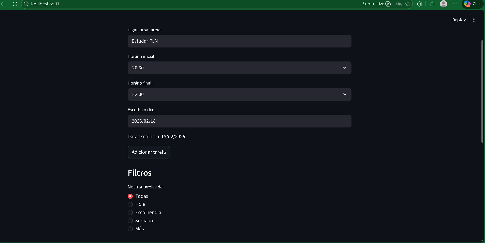

# Gerenciador de Tarefas com Agenda 🗓️✅

Este projeto é um **Gerenciador de Tarefas** desenvolvido em **Python** com **Streamlit**, que permite organizar atividades com **data, horário inicial e final**, além de marcar como concluídas, remover, exportar e importar tarefas em formato CSV.

---


## 🚀 Funcionalidades

- **Adicionar tarefas** com:
  - Título
  - Data (formato brasileiro: DD/MM/AAAA)
  - Horário inicial e final
- **Listar tarefas** com filtros:
  - Todas
  - Hoje
  - Dia específico
  - Semana
  - Mês
- **Ordenação automática** por data e horário inicial
- **Marcar tarefas como concluídas**
- **Remover tarefas**
- **Exportar tarefas filtradas para CSV** com botão de download
- **Importar tarefas de CSV** (substitui todas as existentes)
- **Botão de atualização manual (tipo F5)** após importação
- **Observação importante**: Sempre faça o download/exportação antes de importar, para manter um backup em caso de reversão.

---

## 🖥️ Como executar no Windows com Visual Studio Code

### 1. Pré-requisitos
- Instalar **Python 3.10+**
- Instalar **pip** (gerenciador de pacotes do Python)
- Instalar **Visual Studio Code**
- Instalar extensão **Python** no VS Code


### 2. Executar o programa
- Ativar:  .\venv\Scripts\activate
- Instalar pip install streamlit
- python -m pip show streamlit
- streamlit run app.py
  

### 3. Clonar o repositório
No terminal do VS Code:
```bash
git clone https://github.com/Gedionir/projeto-tarefas.git
cd projeto-tarefas


## 📸 Prints do Programa

### Tela inicial


### Adicionando uma tarefa


>>>>>>> 420cb016376e9f91b0a41179634adba49b3a0e6a


## 📸 Telas do Aplicativo

### Tela Inicial


### Adicionar Tarefa

